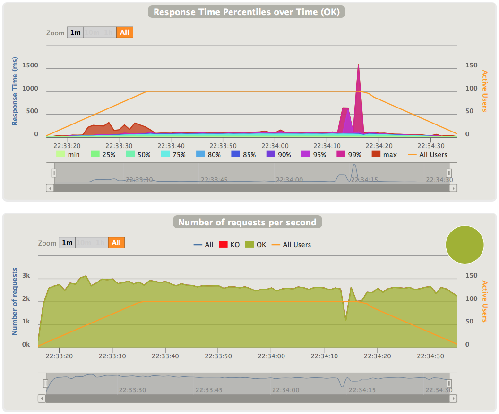
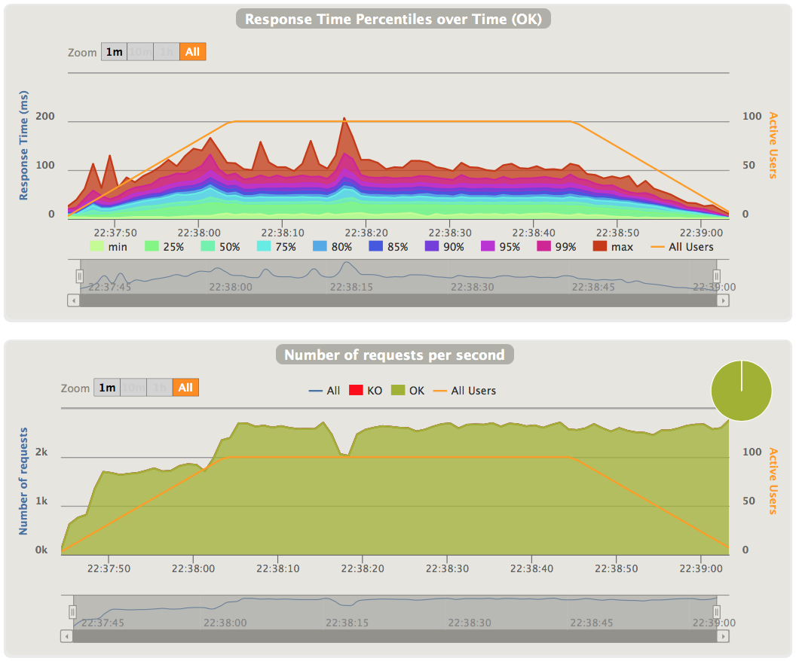
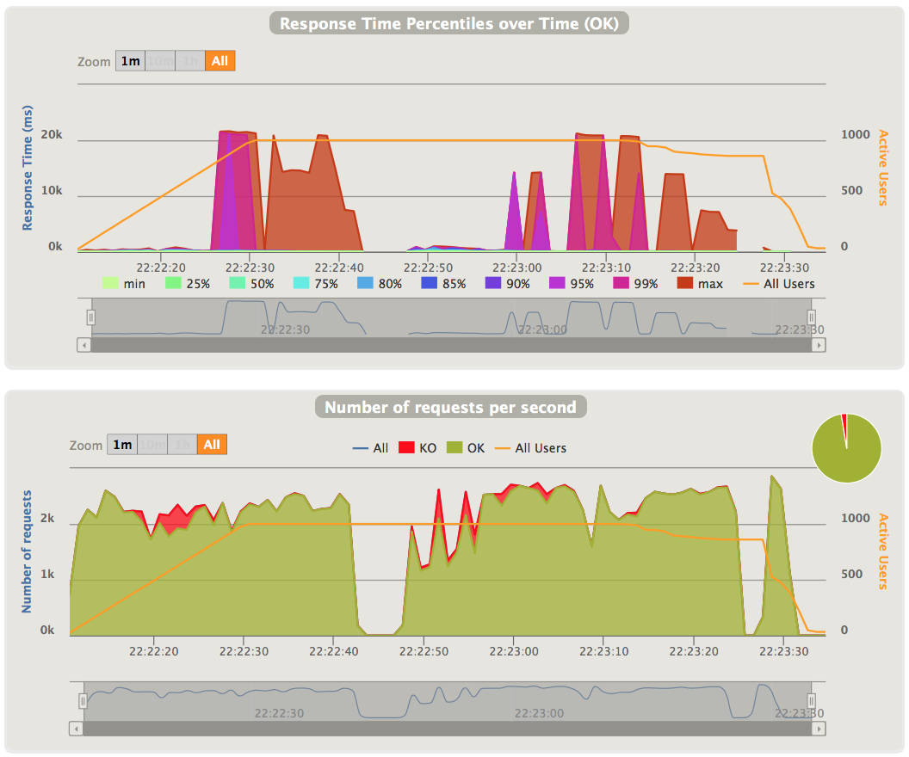
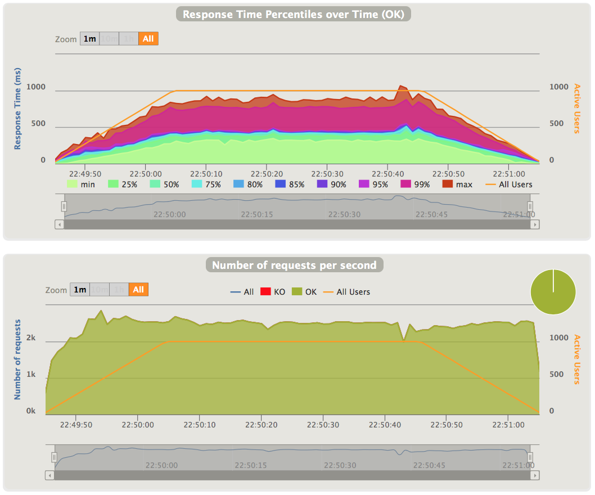

#Make hybris OCC API asynchronize with Netty

#Motivation
- high throughput
- high concurrency
- high scalability
- seperation of connection and business thread pool
- less resource utilization

#Environment
##Software
- SAP Hybris commerce suite 6.0 beta
- Netty 4.1 CR2
- Gatling 2.1

##Design
[The Omni Commerce Connect (OCC)](https://wiki.hybris.com/display/release5/OCC+Architecture+Overview) is a next-generation commerce-driven RESTful web services API that offers a broad set of commerce and data services which enable you to use and leverage the complete hybris Commerce Suite functionality anywhere in your existing application landscape. 

[Netty](http://netty.io) is an asynchronous event-driven network application framework for rapid development of maintainable high performance protocol servers & clients. We will use Netty to make OCC API asynchronize in this chapter. Async servlet can also be used to do this. We will discuss later in other chapter. stay tuned!

I recommend to use async servlet to do OCC asynchronize in project for better leveraging existing logic.

| Features | Async servlet | Netty |
| --- | --- | --- |
| code change | internal/code tangling | external/cross cutting |
| OCC API async | :white_check_mark: | :white_check_mark: |
| Web pages async | :white_check_mark: | :x: |

#Implementation

#Stress testing
:warning::warning::warning: This is NOT a through testing :warning::warning::warning:

In this case, I only tested one OCC API product detail service. (/rest/v2/{site}/products/{productcode})

Figure:point_up:: Testing statistics/Spring MVC based OCC API/100 users

Figure:point_up:: Testing statistics/Netty based OCC API/100 users

As you can see form these figures, default OCC API based on Spring MVC has slight better response time and tps under light load. but Netty based OCC API has less resource utilization.

Figure:point_up:: Response time and TPS/Spring MVC based OCC API/100 users

Figure:point_up:: Response time and TPS/Netty based OCC API/100 users

Figure:point_up:: Testing statistics/Spring MVC based OCC API/1000 users

Figure:point_up:: Testing statistics/Netty based OCC API/1000 users

As you can see form these figures, Netty base OCC API has much better and stable response time and tps than default OCC API under high load. Netty based OCC API still has less resource utilization than default OCC API.

There are some dropped connections for default Spring MVC based OCC API when have 500 more users. (Red part in tps figure)

Figure:point_up:: Response time and TPS/Spring MVC based OCC API/1000 users

Figure:point_up:: Response time and TPS/Netty based OCC API/1000 users

#Conclusion
There is no significant difference on response time and tps under light load for both sync and async implementation.
Asynchronization has much better and stable performance than sync under high load.

#Open issues
- some logic is hard coded

#Next step
- Full funcational testing
- Move part of OAUTH2 logic to Nginx + Lua
- Modulize as an extension

#References
[Netty project](http://netty.io)

Winston Zhang (colorzhang@gmail.com)

Feburary 14, 2016
